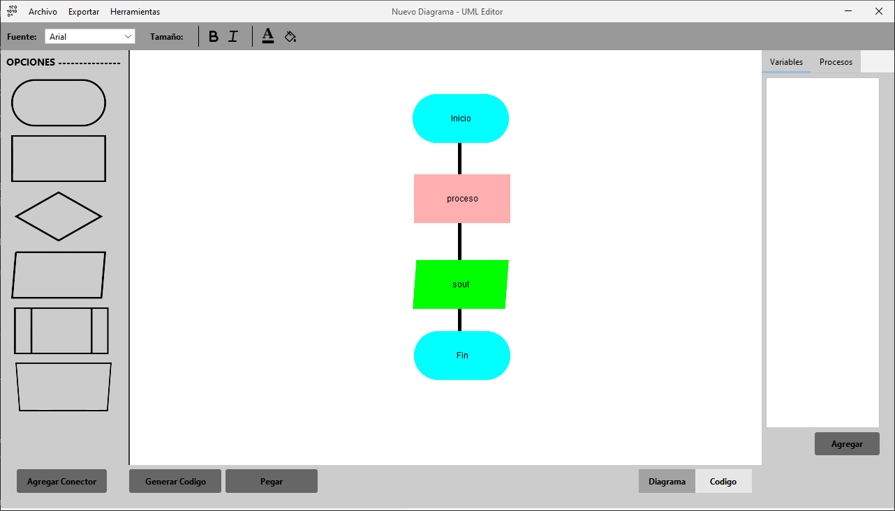

# 🧰 UML BUILDER



## 📍 Description

A Java Swing Application for creating **``UML``** Diagrams and Classes. 

## 📋 Characteristics

- Create Basic UML Diagrams with options of Start, End, Processes, Variables, Operations, Loops, Decisions
- Create UML Classes with Attributes, Methods and Inheritance.
- Change Element Figure style (Font, Background, Foreground, Size).
- File persistence for saving and working on later.
- Export to PDF Options.
- Generate C++ Basic Code.

## ⚙ Installation

```bash
git clone https://github.com/JacobEscoto/uml-to-cpp.git
cd uml-to-cpp
code .    //For Working in VS Code
```

## 📦 External Libraries Used

- FlatLaf (Look & Feel)
- Ikonli Core, Swing and Material Design (Icons)
- Apache PDFBox
